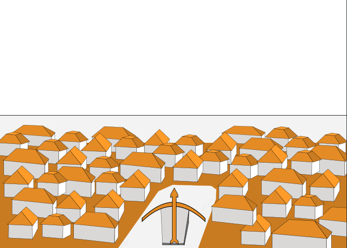

# Jogo das Rainhas

Jogo simples com inspiração no universo de Guerra dos Tronos (Game of Thrones) para oficinas de programação utilizando Python e a biblioteca pygame.

## Licença

[Apache 2.0](https://www.apache.org/licenses/LICENSE-2.0.html) para código

[CC0 (Domínio Público)](https://creativecommons.org/share-your-work/public-domain/cc0/) para as imagens

Ou seja, use como bem entender!